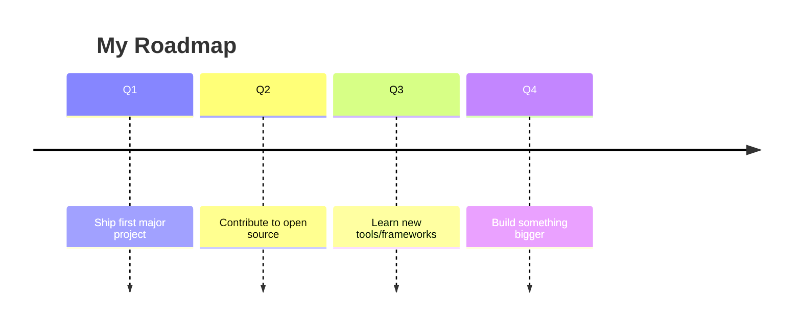

<!-- Animated Wave Header -->


<!-- Typing Intro -->
<div align="center">
  
</div>

<!-- Social Badges & Visitor Counter -->
<div align="center">
  <a href="https://linkedin.com/in/YOUR_LINKEDIN_HERE" target="_blank"></a>
  <a href="https://twitter.com/YOUR_TWITTER_HERE" target="_blank"></a>
  <a href="https://dev.to/AIoniser" target="_blank"></a>
  <a href="mailto:you@email.com"></a>
  <br />
  
</div>

<br />

<!-- About Me (YAML format) -->
```yaml
name: AIoniser
role: Software Developer
location: Earth
currently_building: Aperture_Website
currently_learning: Advanced React & Next.js
looking_to_collaborate_on: Open Source Projects
fun_fact: I love building awesome things!
```

<!-- Random Dev Quote -->
<div align="center">
  
</div>

<br />

<!-- Tech Stack Icons -->
### 💻 Tech Stack
<div align="center">
  <a href="https://skillicons.dev">
    
  </a>
</div>

<br />

<!-- GitHub Stats & Top Languages -->
### 📊 GitHub Stats
<div align="center">
  
  
</div>

<!-- Streak Stats -->
<div align="center">
  
</div>

<!-- Activity Graph -->
### 📈 Activity Graph
<div align="center">
  
</div>

<!-- Trophy Row -->
### 🏆 GitHub Trophies
<div align="center">
  
</div>

<!-- 3D Contribution Calendar -->
### 🧊 3D Contribution Calendar
<div align="center">
  
</div>

<!-- Snake Animation -->
### 🐍 Contribution Snake
<div align="center">
  <picture>
    <source media="(prefers-color-scheme: dark)" srcset="https://raw.githubusercontent.com/AIoniser/AIoniser/output/github-contribution-grid-snake-dark.svg">
    <source media="(prefers-color-scheme: light)" srcset="https://raw.githubusercontent.com/AIoniser/AIoniser/output/github-contribution-grid-snake.svg">
    
  </picture>
</div>

<br />

<!-- Pinned Projects -->
### 📌 Pinned Projects
<div align="center">
  <table>
    <tr>
      <td width="50%">
        <a href="https://github.com/AIoniser/Aperture_Website">
          
        </a>
      </td>
      <td width="50%">
        <!-- Space reserved for future project -->
      </td>
    </tr>
    <tr>
      <td width="50%">
        <!-- Space reserved for future project -->
      </td>
      <td width="50%">
        <!-- Space reserved for future project -->
      </td>
    </tr>
  </table>
</div>

<br />

<!-- Collapsible Sections -->
### 📝 More About Me

<details>
  <summary><b>📰 Latest Blog Posts</b></summary>
  <br />
  <!-- BLOG-POST-LIST:START -->
  <ul>
    <li><i>No posts yet. Check back soon!</i></li>
  </ul>
  <!-- BLOG-POST-LIST:END -->
</details>

<details>
  <summary><b>🏅 Achievements & Milestones</b></summary>
  <br />
  <ul>
    <li>✅ Created my awesome new GitHub profile</li>
    <li>🚀 Shipped Aperture_Website</li>
    <li>... Add more milestones here! ...</li>
  </ul>
</details>

<details>
  <summary><b>🗺️ Roadmap</b></summary>
  <br />
  

</details>

<br />

<!-- Animated Wave Footer -->

